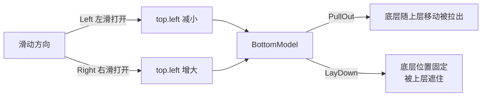
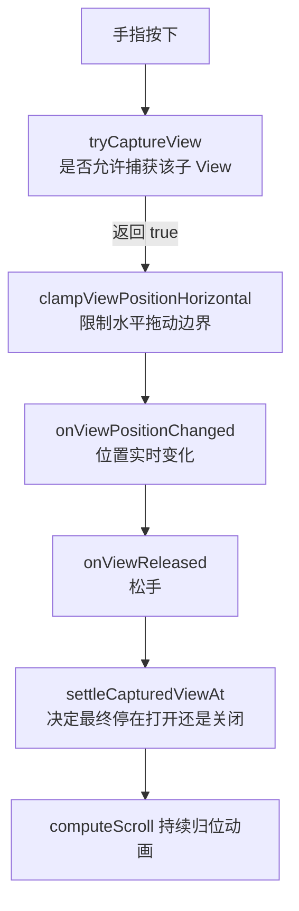
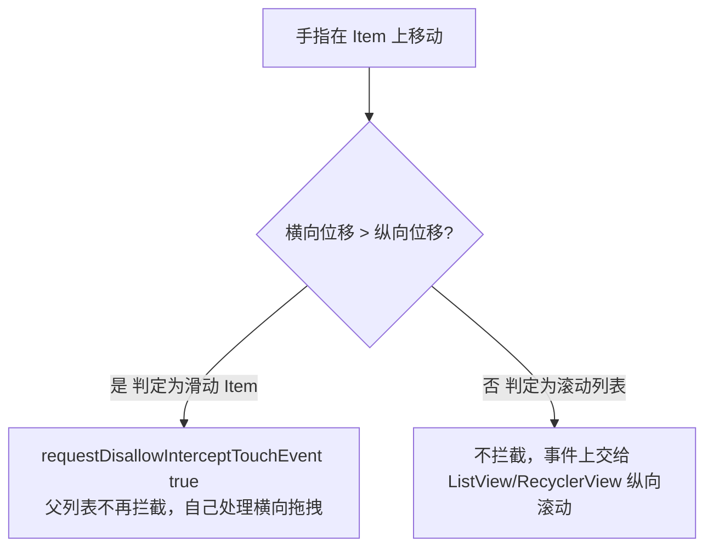
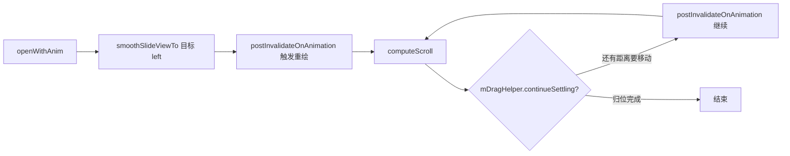
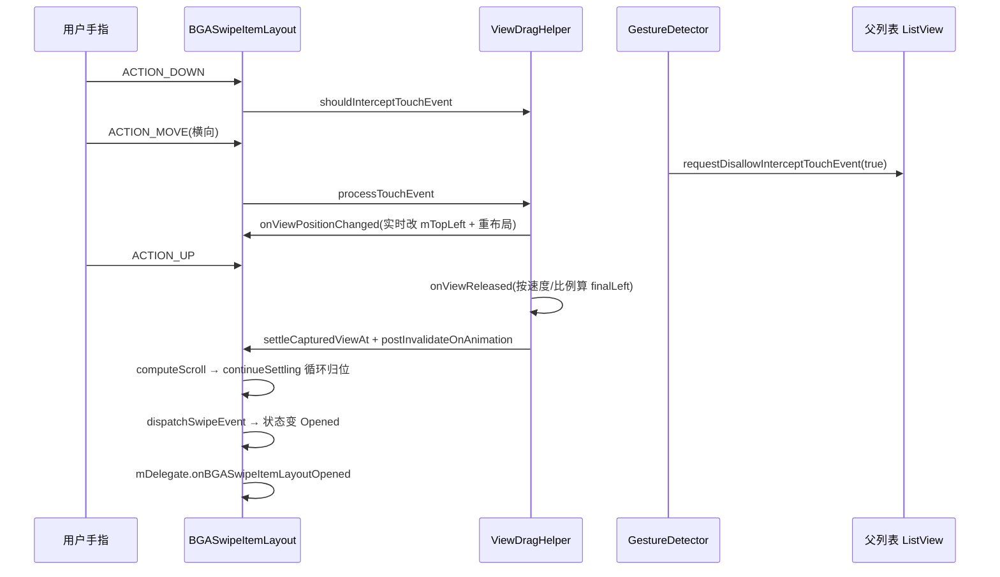

# BGASwipeItemLayout 原理详解

> 面向刚接触 Android 自定义控件的同学。读完本文，你不仅能理解 `BGASwipeItemLayout` 是怎么实现的，更重要的是掌握一套**自定义 ViewGroup、处理拖拽、解决滑动冲突、保存状态**的通用套路，可以原样迁移到其它项目（侧滑菜单、下拉刷新、拖拽排序、抽屉布局等都用得到）。

---

## 一、这个库是做什么的

`BGASwipeItemLayout` 是一个**可左右滑动的 Item 容器**，效果类似 iOS 的「左滑删除」：

- 每个 Item 有两层：上层是正常内容（头像、标题…），下层是隐藏的操作按钮（删除、置顶…）。
- 手指横向滑动 Item，上层被推开，露出下层的按钮；松手后根据滑动距离/速度自动「完全打开」或「回弹关闭」，并带一点**弹簧（越界回弹）**效果。
- 它既可以作为 `ListView` / `GridView`（`AbsListView`）的 item，也可以作为 `RecyclerView` 的 item。

一句话定位：**它本质是一个重写了布局与触摸事件分发的 `FrameLayout` 子类。**

---

## 二、整体架构

### 2.1 类继承关系

```
ViewGroup
  └── FrameLayout            // 自带「子 View 默认叠放在左上角」的能力
        └── BGASwipeItemLayout
```

选 `FrameLayout` 是有讲究的：它默认让子 View 全部叠在左上角，省去了我们自己去写 `onLayout` 把两个子 View 重叠摆放的样板代码，我们只需在 `onLayout` 里**精确控制它们的 left/right** 即可。

### 2.2 两个子 View 的约定（非常重要）

`BGASwipeItemLayout` **有且只能有两个直接子 View**，在 `onFinishInflate()` 中强制校验：

```java
if (getChildCount() != 2) {
    throw new IllegalStateException("必须有且只有两个子控件");
}
mTopView = getChildAt(1);    // 第 2 个子 View = 上层（内容区）
mBottomView = getChildAt(0); // 第 1 个子 View = 下层（操作按钮区）
mBottomView.setVisibility(INVISIBLE); // 关闭时隐藏，避免被误点
```

> 约定记忆：**写在 XML 里靠后的那个是顶层内容，靠前的那个是底层按钮**。例如 demo 中：

```xml
<cn.bingoogolapple.swipeitemlayout.BGASwipeItemLayout ...>
    <ImageView android:id="@+id/iv_delete" .../>   <!-- 第 1 个：底层按钮 -->
    <LinearLayout ...> ... </LinearLayout>          <!-- 第 2 个：顶层内容 -->
</cn.bingoogolapple.swipeitemlayout.BGASwipeItemLayout>
```

### 2.3 核心成员变量

| 变量 | 含义 |
| --- | --- |
| `mTopView` / `mBottomView` | 上层内容、下层按钮 |
| `mDragHelper` | 拖拽发动机（`ViewDragHelper`） |
| `mDragRange` | 可拖动的最大距离（= 底层按钮宽度 + 其左右 margin） |
| `mSpringDistance` | 弹簧距离：允许拖出 `mDragRange` 之外的额外越界量 |
| `mSwipeDirection` | 左滑打开（`Left`）还是右滑打开（`Right`） |
| `mBottomModel` | 底层按钮展现方式：`PullOut`（随上层移动被拉出）/ `LayDown`（固定不动，被上层遮住） |
| `mCurrentStatus` / `mPreStatus` | 当前状态 / 滑动前状态（`Opened`/`Closed`/`Moving`） |
| `mTopLeft` | 上层 View 下一次 `layout` 时的 left，是「滑动进度」的核心变量 |
| `mDragRatio` | 滑动比例：关闭→打开 = `0→1` |
| `mDelegate` | 状态变化回调（打开/关闭/开始打开） |

### 2.4 自定义属性（`attrs.xml`）

```xml
<declare-styleable name="BGASwipeItemLayout">
    <attr name="bga_sil_swipeDirection" format="enum">   <!-- left / right -->
    <attr name="bga_sil_bottomMode" format="enum">       <!-- pullOut / layDown -->
    <attr name="bga_sil_springDistance" format="dimension"/>
    <attr name="bga_sil_swipeAble" format="boolean"/>
</declare-styleable>
```

在构造函数里通过 `TypedArray` 读取，这是自定义 View 接收 XML 配置的**标准做法**。

---

## 三、核心原理拆解（重点）

下面这 8 个点是自定义控件面试时最常被深挖的，务必理解「为什么这么做」。

### 3.1 自定义 ViewGroup 的布局：`onLayout` 如何摆放两个 View

`FrameLayout` 已经帮我们 `measure` 好了子 View，我们要做的是在 `onLayout` 中决定它们的最终位置。

关键计算（以「左滑 + PullOut」为例）：

```java
mDragRange = mBottomView.getMeasuredWidth() + mBottomLp.leftMargin + mBottomLp.rightMargin;

// 上层：left 由 mTopLeft 决定（mTopLeft 会在拖拽中被实时修改）
mTopView.layout(mTopLeft, topTop, topRight, topBottom);

// 底层（PullOut 模式）：跟随上层移动，left = 上层 right + margin
bottomLeft = mTopLeft + mTopView.getMeasuredWidth() + mTopLp.rightMargin + mBottomLp.leftMargin;
bottomLeft = Math.max(bottomLeft, minBottomLeft); // 限制最小 left，避免越界
mBottomView.layout(bottomLeft, bottomTop, bottomRight, bottomBottom);
```

四种组合的差异（理解即可，不必死记）：



> **为什么 `mDragRange` 放在 `onLayout` 里算？** 因为子 View 的宽高只有在 `measure` 之后（`onLayout` 阶段）才拿得到，不能放在构造函数里。

### 3.2 `ViewDragHelper`：拖拽的发动机（最核心）

`ViewDragHelper` 是 Android support 包提供的**拖拽辅助类**，它把「捕获手指、计算位移、限制边界、惯性滑动、自动归位」等脏活都封装好了。我们只要实现它的 `Callback`。

**（1）创建并接管事件**

```java
mDragHelper = ViewDragHelper.create(this, mDragHelperCallback);
```

在三个关键位置把事件交给它：
- `onInterceptTouchEvent` → `mDragHelper.shouldInterceptTouchEvent(ev)`
- `onTouchEvent` → `mDragHelper.processTouchEvent(event)`
- `computeScroll` → `mDragHelper.continueSettling(true)`（驱动自动归位动画）

**（2）`Callback` 的几个关键方法**



- `tryCaptureView(child, pointerId)`：返回 `mSwipeable && child == mTopView`。只有上层、且允许滑动时才捕获。
- `clampViewPositionHorizontal(child, left, dx)`：**核心边界限制**。把 `left` 限制在 `[minTopLeft, maxTopLeft]` 之间（向左滑时允许的最小值是 `padding+margin-(mDragRange+mSpringDistance)`）。这是「为什么拖不出界」的根本原因。
- `getViewHorizontalDragRange`：返回 `mDragRange + mSpringDistance`，告诉系统水平可拖动范围（影响事件拦截判断）。
- `onViewPositionChanged`：拖拽过程中实时回调。这里做三件事：
  1. 记录 `mTopLeft = left`；
  2. 计算 `mDragRatio = 偏移量 / mDragRange`（用于底层按钮透明度 `0.1 + 0.9*ratio`）；
  3. `requestLayout()` 重新摆放两个 View。
- `onViewReleased`：松手时根据**速度**和**当前比例**决定最终打开还是关闭：

```java
if (xvel < -VEL_THRESHOLD                       // 快速向左甩
    || (mPreStatus==Closed && xvel < VEL_THRESHOLD && mDragRatio >= 0.3f)  // 关闭态滑过 30%
    || (mPreStatus==Opened && xvel < VEL_THRESHOLD && mDragRatio >= 0.7f)) // 打开态滑过 70%
    finalLeft -= mDragRange;                    // 打开
// 否则 finalLeft 回到原处 = 关闭
mDragHelper.settleCapturedViewAt(finalLeft, ...); // 平滑移动到目标位置
ViewCompat.postInvalidateOnAnimation(this);        // 触发 computeScroll 持续动画
```

> **`VEL_THRESHOLD = 400`** 是速度阈值（像素/秒），超过即判定为「甩动」。这正是 `VelocityTracker` 的用法体现——`ViewDragHelper` 内部已经帮我们追踪了手指速度。

### 3.3 触摸事件分发与滑动冲突处理（高频考点）

`BGASwipeItemLayout` 既要处理**横向滑动**，又处在 `ListView`/`RecyclerView` 这种**纵向滚动**的列表里，天然存在**滑动冲突**。解决思路是经典的「方向判定 + 请求父 View 不要拦截」。

```java
// onInterceptTouchEvent：是否要自己处理这次触摸
public boolean onInterceptTouchEvent(MotionEvent ev) {
    if (ev.getAction() == ACTION_CANCEL || ev.getAction() == ACTION_UP) {
        mDragHelper.cancel();
    }
    return mDragHelper.shouldInterceptTouchEvent(ev) && mGestureDetectorCompat.onTouchEvent(ev);
}

// onTouchEvent：自己消费事件
public boolean onTouchEvent(MotionEvent event) {
    mDragHelper.processTouchEvent(event);
    mGestureDetectorCompat.onTouchEvent(event);
    return true; // 返回 true 表示已消费
}
```

**滑动冲突的解决（关键）：**

```java
public boolean onScroll(MotionEvent e1, MotionEvent e2, float distanceX, float distanceY) {
    if (Math.abs(distanceX) > Math.abs(distanceY)) {
        // 判定为横向滑动 → 禁止父 View（列表）拦截事件，自己独占
        requestParentDisallowInterceptTouchEvent();
        return true;
    }
    return false;
}
private void requestParentDisallowInterceptTouchEvent() {
    ViewParent parent = getParent();
    if (parent != null) parent.requestDisallowInterceptTouchEvent(true);
}
```



> 这就是 Android 事件分发「内部拦截法」的标准套路：`子 View` 在判定自己要处理时，调用父 View 的 `requestDisallowInterceptTouchEvent(true)`，让父 View 把后续事件都交给自己。横向 `RecyclerView` 嵌套纵向 `RecyclerView`、ViewPager 嵌套滑动页等，都是同一套思路。

### 3.4 `GestureDetector`：精确区分点击 / 长按 / 滑动

为什么不直接在 `onTouchEvent` 里手写判断？因为「单击 / 长按 / 滑动 / 甩动」的识别（比如长按要 500ms、单击不能和双击混淆）非常繁琐且易错。`GestureDetector` 已经封装好，我们只要重写关心的回调：

| 回调 | 含义 | 本库用途 |
| --- | --- | --- |
| `onSingleTapUp` / `onSingleTapConfirmed` | 单击抬起 / 确认单击 | 关闭态下触发 `performClick()` |
| `onLongPress` | 长按 | 关闭态下 `performLongClick()` |
| `onScroll` | 滑动中 | 方向判定 + 禁止父 View 拦截（见 3.3） |
| `onFling` | 快速甩动 | 同样用于方向判定 |

注意代码里有个细节：`onSingleTapUp` 里 `setPressed(true)`，`onSingleTapConfirmed` 里 `setPressed(false)` 并 `performClick()`——这是为了在「按下高亮」和「确认单击」之间做正确的视觉与逻辑分离。

### 3.5 打开 / 关闭与状态机

状态用枚举：`Opened` / `Closed` / `Moving`，并用 `mCurrentStatus` + `mPreStatus` 双变量描述「当前」与「滑动前」。

对外暴露的 4 个方法：

```java
open()          // 瞬间打开（直接 requestLayout，无动画）
close()         // 瞬间关闭
openWithAnim()  // 动画打开：smoothSlideViewTo(1) + 触发 computeScroll
closeWithAnim() // 动画关闭
```

动画的驱动链条（经典写法，务必记住）：



状态切换时通过 `mDelegate` 回调通知外部（demo 里用它实现「打开新的、自动关闭之前打开的那个」）：

```java
public interface BGASwipeItemLayoutDelegate {
    void onBGASwipeItemLayoutOpened(...);   // 变为打开
    void onBGASwipeItemLayoutClosed(...);   // 变为关闭
    void onBGASwipeItemLayoutStartOpen(...);// 从关闭切到正在打开
}
```

### 3.6 作为列表 Item 的单击 / 长按转发（AbsListView 适配）

当 `BGASwipeItemLayout` 作为 `ListView` 的 item 时，用户点的是 Item 里的某个控件，但 `ListView` 需要收到「第几个 item 被点击」才能触发 `OnItemClickListener`。库在 `onAttachedToWindow` 里自动处理：

```java
private boolean insideAdapterView() {
    return getParent() instanceof AdapterView; // 父是 ListView/GridView 等
}
```

- 单击：用 `AdapterView.getPositionForView(this)` 拿到位置，再调用 `view.performItemClick(...)` 把点击「转发」给 ListView。
- 长按：`AbsListView.performLongPress(...)` 是 `protected` 方法，外部拿不到，所以**用反射**调用：

```java
Method m = AbsListView.class.getDeclaredMethod("performLongPress", View.class, int.class, long.class);
m.setAccessible(true);
handled = (boolean) m.invoke(view, this, p, vId);
```

> 这是「反射访问系统隐藏/受保护 API」的一个真实案例。若反射失败（不同系统版本方法签名变化），则降级到 `getOnItemLongClickListener()` 手动回调。

### 3.7 状态保存与恢复（`onSaveInstanceState`）

横竖屏切换或内存不足回收后，Activity/View 会重建。为了记住某个 Item 是开是关，库实现了 `Parcelable` 状态保存：

```java
protected Parcelable onSaveInstanceState() {
    Bundle bundle = new Bundle();
    bundle.putParcelable(INSTANCE_STATUS, super.onSaveInstanceState()); // 先存父类状态
    bundle.putInt(STATUS_OPEN_CLOSE, mCurrentStatus.ordinal());         // 再存自己的状态
    return bundle;
}
public void onRestoreInstanceState(Parcelable state) {
    // 读回 ordinal，Opened 就 open()，否则 close()
}
```

> 套路：自定义 View 要保存状态时，**必须先用 `super.onSaveInstanceState()` 取出父类状态、包进自己的 Bundle，恢复时也必须调用 `super.onRestoreInstanceState()` 把父类状态交还**（本库就是先读自己的 `ordinal`、再调用 `super`）。否则会丢失系统级状态（如焦点、滚动位置）甚至崩溃。

### 3.8 弹簧效果（`springDistance`）

`mSpringDistance` 让 Item 可以被拖出「按钮完全露出」之外一小段（越界），松手后自动弹回。实现就在两处：

- 边界限制：`clampViewPositionHorizontal` 中允许的范围是 `mDragRange + mSpringDistance`（比正常多一段）。
- 松手归位：`onViewReleased` 里 `finalLeft` 只减 `mDragRange`（**不**减 `springDistance`），所以一定会弹回到「刚好完全打开」的位置，而不是停在越界处。

---

## 四、端到端时序图（一次完整的左滑打开）



---

## 五、如何举一反三（迁移到其他项目）

掌握本库的套路后，以下场景你都能直接复用：

1. **自定义 ViewGroup 通用模板**
   - 继承合适的原生容器（`FrameLayout`/`ViewGroup`）减少样板；
   - `onFinishInflate` 校验并缓存子 View；
   - `onLayout` 里根据自定义变量精确摆放子 View；
   - 需要 XML 配置就写 `attrs.xml` + `TypedArray`。

2. **任何「拖一下」的需求 → 优先用 `ViewDragHelper`**
   - 侧滑删除菜单、可拖拽排序的卡片、抽屉（Drawer）、下拉刷新头部，底层都是「捕获子 View + 限制边界 + 松手归位」，把 `Callback` 的几个方法填好即可。

3. **滑动冲突 → 内部拦截法**
   - 子 View 在 `onScroll`/方向判定里，横向需求就 `requestDisallowInterceptTouchEvent(true)`；
   - 记住口诀：**「谁需要动，谁就在判定后禁止父 View 拦截」**。

4. **手势识别 → 别手写，用 `GestureDetector`**
   - 单击/双击/长按/滑动/甩动，交给系统识别，代码更干净也更准。

5. **带动画的归位 → `smoothSlideViewTo` + `computeScroll` + `continueSettling`**
   - 这是 Android 实现「惯性/平滑移动」的标准三段式，可套用到任何需要平滑动画的自定义 View。

6. **状态保存 → `onSaveInstanceState` 包父类状态**
   - 任何有「视觉状态」的自定义 View（开关、展开收起、选中项）都应实现，避免旋转屏幕后状态丢失。

---

## 六、常见坑与注意点

| 现象 | 原因 / 解决 |
| --- | --- |
| 崩溃：`必须有且只有两个子控件` | XML 里 `BGASwipeItemLayout` 的直接子 View 必须是 2 个，且顺序为「底层按钮在前、顶层内容在后」。 |
| `ListView` 删除一个「处于打开状态」的 item 后错乱 | 删除前必须先 `close()`（见 `README` 说明）。因为 `ListView` 会复用 convertView，残留的打开状态会污染复用后的 item。 |
| 滑动时列表跟着上下滚 | 方向判定 / `requestDisallowInterceptTouchEvent` 未生效，检查是否横向位移真的大于纵向。 |
| 弹簧距离不生效 / 构建报错 | `build.gradle` 里 `support-v4` 锁定在 `27.1.1`：support 28 的两个 AAR 的 `namespace` 重复，会导致 AGP 7.0+ 的 manifest 合并失败，属依赖兼容性坑，不要随意升级。 |
| 底层按钮在关闭时还能点到 | 库已在 `onFinishInflate` 把 `mBottomView` 设为 `INVISIBLE`；若你自定义改了这里，记得保持隐藏。 |

---

## 七、一句话总结

`BGASwipeItemLayout` = **FrameLayout + ViewDragHelper（拖拽发动机）+ GestureDetector（手势识别）+ 事件内部拦截（解决滑动冲突）+ Parcelable（状态保存）**。把这五个零件吃透，你就掌握了 Android 自定义交互控件 80% 的核心能力。

---

## 附：面试高频考点速记

### 速记口诀

| 口诀 | 含义 |
| --- | --- |
| **「继承 FrameLayout，子 View 叠左上」** | 选 FrameLayout 省去手写重叠布局的样板，只在 `onLayout` 精确控制 left/right |
| **「两个子 View，按钮在前内容在后」** | `onFinishInflate` 校验有且只能 2 个；`getChildAt(0)`=底层按钮，`getChildAt(1)`=顶层内容；关闭时底层 `INVISIBLE` 防误点 |
| **「dragRange 在 onLayout 才算」** | 子 View 宽高只有 measure 之后（onLayout 阶段）才拿得到，不能放构造函数 |
| **「谁要动，谁禁父拦截」** | 横向需求判定后调 `parent.requestDisallowInterceptTouchEvent(true)`——内部拦截法 |
| **「ViewDragHelper 当发动机」** | 捕获、边界、惯性、归位全封装，只填 `Callback` 几个方法 |
| **「三段式平滑归位」** | `smoothSlideViewTo` → `postInvalidateOnAnimation` → `computeScroll` 里 `continueSettling` 循环 |
| **「弹簧：松手减 dragRange，不减去 spring」** | 边界允许多拖 springDistance，但归位只减 dragRange，故自动弹回「刚好全开」 |
| **「保存状态先存父类」** | `onSaveInstanceState` 先把 `super` 状态包进 Bundle，恢复时也要先交还父类 |

### 高频问答（自测）

**1. 为什么继承 FrameLayout 而不是 ViewGroup？**
> FrameLayout 默认把子 View 叠放在左上角，省去手写重叠 `onLayout` 的样板；只需在 `onLayout` 里精确控制两个子 View 的 left/right。

**2. 为什么子 View 必须是 2 个、且顺序是「按钮在前、内容在后」？**
> 库在 `onFinishInflate` 强制校验，约定 `getChildAt(0)` 为底层按钮、`getChildAt(1)` 为顶层内容，关闭时把底层设为 `INVISIBLE` 防误点。

**3. 滑动冲突怎么解决？用的是外部拦截还是内部拦截？**
> 内部拦截法。在 `GestureDetector.onScroll` 中判定 `|distanceX| > |distanceY|`（横向意图）时，调 `getParent().requestDisallowInterceptTouchEvent(true)`，让父列表（ListView/RecyclerView）把后续事件全交给自己；纵向意图则不拦截，事件上交给父 View 滚动。

**4. ViewDragHelper 的核心 Callback 方法各负责什么？**
> `tryCaptureView` 决定是否捕获（仅上层且允许滑动）；`clampViewPositionHorizontal` 限制水平边界（拖不出界、可越界 springDistance 的根本）；`getViewHorizontalDragRange` 告知可拖动范围（影响拦截判断）；`onViewPositionChanged` 实时记录 `mTopLeft`、`mDragRatio` 并重布局；`onViewReleased` 按速度/比例决定最终停在打开还是关闭并 `settleCapturedViewAt`。

**5. 松手后怎么决定打开还是关闭？**
> 两个条件取或：`xvel < -VEL_THRESHOLD`（快速左甩，VEL_THRESHOLD=400）；或滑动比例过阈值（Closed 态 ≥0.3、Opened 态 ≥0.7）。满足则 `finalLeft -= mDragRange` 打开，否则回原位关闭。

**6. 平滑动画是怎么跑起来的？**
> `settleCapturedViewAt`/`smoothSlideViewTo` 设定目标位置后 `postInvalidateOnAnimation` 触发 `computeScroll`，其中 `mDragHelper.continueSettling(true)` 持续移动并再次 `postInvalidateOnAnimation`，形成循环直到归位完成。

**7. 弹簧效果（springDistance）如何实现？**
> 边界限制允许拖到 `mDragRange + mSpringDistance`（越界）；但松手 `finalLeft` 只减 `mDragRange`，所以一定弹回到「刚好完全打开」，越界段是临时手感。

**8. 为什么还要用 GestureDetector？**
> 单击/双击/长按/滑动/甩动的识别（长按 500ms、单击去双击混淆）手写繁琐易错；交给 `GestureDetector` 重写关心的回调即可（单击转发点击、长按转发长按、onScroll 做方向判定）。

**9. 作为 ListView item 时点击/长按怎么转发给 ListView？**
> 单击用 `AdapterView.getPositionForView(this)` 取位置后 `performItemClick` 转发；长按因 `AbsListView.performLongPress` 是 `protected`，用反射调用，失败则降级到 `getOnItemLongClickListener` 手动回调。

**10. 自定义 View 保存状态的正确姿势？**
> `onSaveInstanceState` 先 `super.onSaveInstanceState()` 取出父类状态包进自己的 Bundle，再存自身状态（如状态枚举 ordinal）；`onRestoreInstanceState` 先读自身、再 `super` 交还父类。否则丢失系统状态甚至崩溃。

**11. 删除「打开态」item 后错乱，为什么？怎么解？**
> ListView 复用 convertView，残留的打开状态污染复用后的 item。删除前必须先 `close()`。

**12. support-v4 为什么锁在 27.1.1 不升级？**
> support 28 的两个 AAR 的 `namespace` 重复，会导致 AGP 7.0+ manifest 合并失败，属依赖兼容性坑，勿随意升级。

### 一图速记（核心零件）

```
FrameLayout          —— 容器基类，子 View 叠放
   ├─ ViewDragHelper —— 拖拽发动机（捕获/边界/惯性/归位）
   ├─ GestureDetector—— 手势识别（点/长按/滑动/甩）
   ├─ requestDisallowInterceptTouchEvent —— 滑动冲突内部拦截
   └─ Parcelable     —— 状态保存（先存父类）
```
